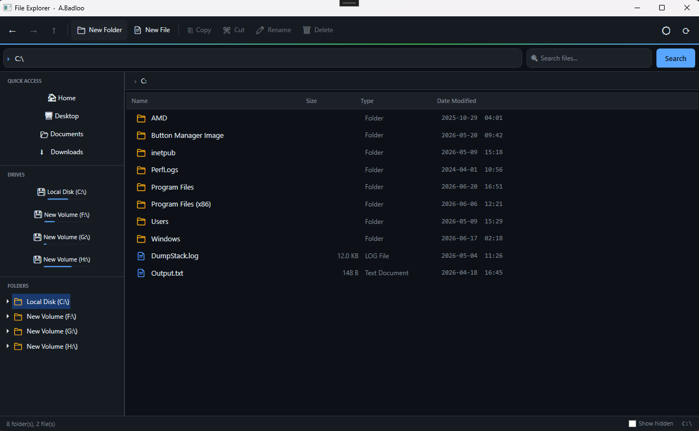
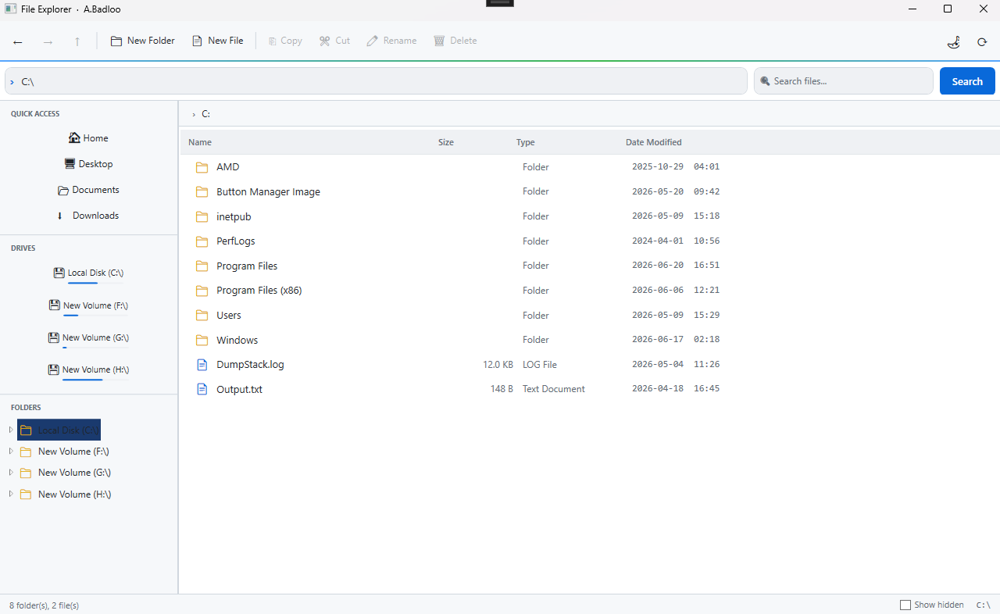

# File Explorer — WPF Desktop App

A modern, feature-rich **File Explorer** built with **C# / WPF / .NET 8** following the **MVVM** architecture pattern.  
Designed as a portfolio project to showcase desktop application development skills.

> **Author:** A.Badloo &nbsp;|&nbsp; **Stack:** C# · WPF · .NET 8 · MVVM · CommunityToolkit

---

## Screenshots

| Dark Theme | Light Theme |
|:---:|:---:|
|  |  |

---

## Demo App

> Download the latest pre-built Windows executable from the **[Releases](../../releases/latest)** page — no installation or .NET runtime required.

**System Requirements**
- Windows 10 / 11 (64-bit)
- No additional dependencies needed (self-contained build)

---

## Features

### Core Navigation
- **Folder Tree** — hierarchical lazy-loading TreeView of the full file system
- **Back / Forward / Up** — full navigation history stack
- **Breadcrumb bar** — clickable path segments for quick navigation
- **Address bar** — type any path and press Enter to navigate directly

### File Operations
| Action | Shortcut |
|--------|----------|
| New Folder | Toolbar |
| New File | Toolbar |
| Copy | `Ctrl+C` |
| Cut | `Ctrl+X` |
| Paste | `Ctrl+V` |
| Rename | `F2` |
| Delete | `Del` |
| Properties | Context menu |
| Refresh | `F5` |

### Search
- Real-time recursive search across the current directory tree
- Runs asynchronously — UI stays responsive during search

### Drive Overview
- Lists all available drives in the sidebar
- Shows a compact usage bar for each drive (used / total space)

### Sorting & Filtering
- Click any column header to sort: **Name**, **Size**, **Type**, **Date Modified**
- Toggle hidden files with a single checkbox in the status bar

### UI / UX
- **Dark & Light theme** — toggle anytime with the toolbar button
- **Smooth animations** — hover, selection, and focus transitions (150 ms)
- **Accent gradient** toolbar separator (blue → green)
- Ultra-thin animated scrollbars that accent on hover
- Left accent stripe on selected list items
- Consistent **Segoe UI** typography throughout

---

## Source Code

### Project Structure

```
FileExplorer/
├── FileExplorer.sln
└── FileExplorer/
    ├── App.xaml / App.xaml.cs         ← Application entry point + global error handler
    ├── MainWindow.xaml / .cs          ← Main UI shell (toolbar, address bar, panels)
    │
    ├── Models/
    │   ├── FileSystemItem.cs          ← File/folder data model
    │   ├── DriveItem.cs               ← Drive model with usage percentage
    │   └── NavigationHistory.cs       ← Back/Forward navigation stack
    │
    ├── ViewModels/
    │   ├── MainViewModel.cs           ← All commands + state (MVVM core)
    │   └── TreeNodeViewModel.cs       ← Lazy-loading tree node
    │
    ├── Services/
    │   ├── FileSystemService.cs       ← Safe file I/O + recursive search
    │   ├── ClipboardService.cs        ← Copy/Cut/Paste state
    │   └── IconService.cs             ← Shell icon extraction (P/Invoke)
    │
    ├── Commands/
    │   └── RelayCommand.cs            ← ICommand implementation
    │
    ├── Converters/
    │   ├── BoolToVisibilityConverter.cs
    │   ├── FileSizeConverter.cs
    │   └── InverseBoolConverter.cs
    │
    ├── Views/
    │   └── InputDialog.xaml / .cs     ← Rename / New-item dialog
    │
    └── Themes/
        ├── DarkTheme.xaml             ← Dark tech palette + animations
        └── LightTheme.xaml            ← Light palette + same animations
```

### Tech Stack

| Layer | Technology |
|-------|-----------|
| Language | C# 12 |
| Framework | .NET 8 (Windows) |
| UI | WPF (Windows Presentation Foundation) |
| Pattern | MVVM (Model-View-ViewModel) |
| Animations | WPF Storyboard / EventTrigger |
| Packages | CommunityToolkit.Mvvm, Microsoft.Xaml.Behaviors.Wpf |

### Build & Run

**Prerequisites**
- [.NET 8 SDK](https://dotnet.microsoft.com/download/dotnet/8.0)
- Windows 10/11

```bash
# Clone
git clone https://github.com/AliBadloo/wpf-file-explorer.git
cd wpf-file-explorer

# Build
dotnet build FileExplorer/FileExplorer.csproj -c Release

# Run
dotnet run --project FileExplorer/FileExplorer.csproj
```

**Or open in Visual Studio 2022+:**
1. Open `FileExplorer.sln`
2. Press `F5` to run

---

## Architecture Highlights

- **Exception-safe file enumeration** — per-item try/catch with pre-fetched arrays; `yield return` never inside a catch block
- **Lazy tree loading** — children loaded only when a node is expanded; prevents scanning the full drive on startup
- **Async search** — uses `Task.Run` + `Dispatcher.Invoke` so the UI thread is never blocked
- **Theme switching** — `Application.Resources.MergedDictionaries` swapped at runtime using proper pack URIs
- **Read-only binding safety** — `ProgressBar.Value` bound with `Mode=OneWay` to avoid binding errors on computed properties
- **Animation isolation** — hover/press effects use locally-named `SolidColorBrush` inside each `ControlTemplate`, avoiding shared-resource freeze issues

---

## License

MIT © 2024 A.Badloo
